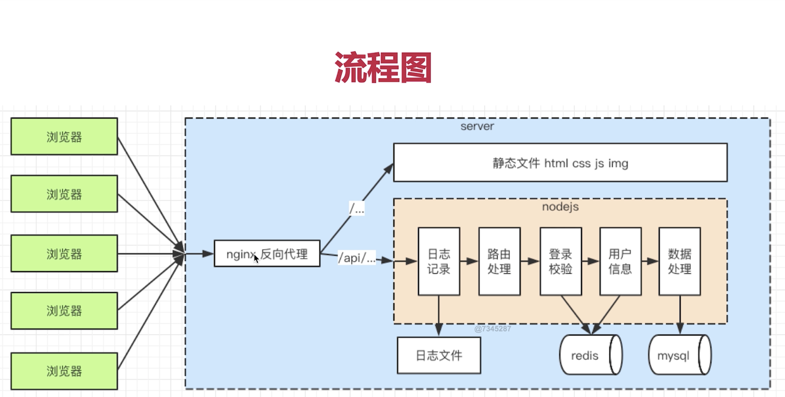

# 这个版本是不使用框架开发server的一个blog系统
这个系统主要聚焦于后端的开发  

## 开发的功能模块，完整的流程
1）处理http接口  
2）链接数据库  
3）实现登录  
4）安全：sql注入，xss攻击，密码加密
5）日志



## 用到的核心知识点
### 1) nodejs 与 JavaScript的区别
1） ECMAScript: 定义了语法，写JavaScript和nodejs都必须遵守（例如变量的定义，原型链等等）  
2）JavaScript使用ECMAScript语法规范，外加web API，缺一不可。web api包含DOM操作，BOM操作，事件绑定，ajax等等  
3）Nodejs使用ECMAScript语法规范，外加nodejs API，缺一不可
nodejs api包含fs Buffer等等，详情见官网  

### 2) server开发和前端开发的区别（重点思路切换）
1）服务稳定性  
2）考虑内存和CPU（优化，扩展）  
3）日志管理  

### 3) nodemon监听文件变化，自动重启node 使用cross-env设置环境变量
```
"dev": "cross-env NODE_ENV=dev nodemon ./bin/www.js",
"prd": "cross-env NODE_ENV=production nodemon ./bin/www.js"
```

### 4) cookie是什么，在登录验证中cookie怎么用？
登录  
- 核心：登录校验，登录信息存储
- cookie session
- session 写入redis
- 开发登录功能，和前端联调（用到nginx 反向代理）

什么是cookie：  
- 存储在浏览器的一段字符串（最大5kb）
- 跨域不共享

登录中使用cookie  
- 自己做一个格式规则；k1=v1;k2=v2;k3=v3; 
- 每次发送http请求，会将请求域的cookie一起发送给server端
- server可以修改cookie并返回给浏览器
- 浏览器也可以修改cookie，但是有限制

### 5) redis 与 session
redis:  
- web server最常用的缓存数据库，数据库放在内存中（内存贵，内存断电丢失）  
- 比mysql，访问速度快（内存和硬盘不是一个数量级的）  
- 但是成本更高，可存储的数据量更小（内存的硬伤）  

为何session适合放在redis中  
- session访问频繁，对性能要求极高  
- session不考虑断电丢失的数据的问题（内存的硬伤） ----断电了重新登录吧  
- session数据量不会太大（相比于MySQL中的数据）  

### 6) 如何与前端进行联调
- 登录依赖cookie 必须使用浏览器进行联调
- cookie跨域不共享，前端和server端必须同域：但是由于server端和前端都在本地，肯定不能用同一个端口：server端口号4000 前端端口号8000
- 因此需要用nignx做代理，让前后端同域

### 7) crontab 定时任务
- 设置定时任务： ***** command
- 将access.log拷贝并重命名为 2020-09-23.access.log
- 清空 access.log 文件，继续积累日志
- 写一个copy.sh命令文件，执行复制&清空的操作，设置crontab定时任务，定时运行这个文件

### 8) 日志分析：
- 例如 针对access.log日志，分析chrome占比
- 日志是按行存储的，一行就是一条日志
- 使用nodejs的readline（基于stream，效率高）

### 9) 安全
- sql注入：窃取数据库内容：escape函数
- xss攻击：窃取前端的cookie内容：xss 库
- 密码加密：保障用户信息安全（重要！）

## server端和前端的区别
1）服务稳定性  
2）考虑内存和CPU（优化，扩展）   
3）日志管理  